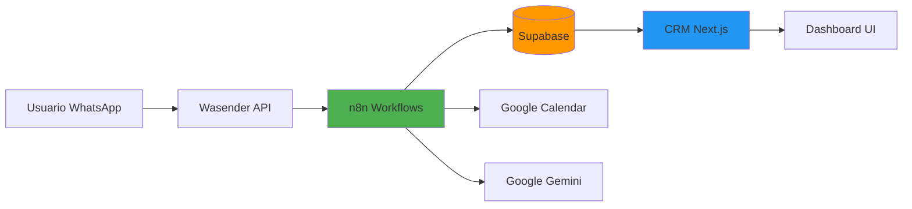

# 📚 Documentación Completa CRM-UROBOT

## 🎯 Resumen Ejecutivo

Este repositorio contiene la documentación técnica completa del sistema CRM-UROBOT, que integra:

- **Frontend**: Next.js 15 + React 19 + TailwindCSS 4
- **Base de Datos**: Supabase (PostgreSQL) con funciones RPC y triggers
- **Automatización**: n8n (7 workflows)
- **IA**: Google Gemini + OpenAI Whisper + Vector Store
- **Mensajería**: WhatsApp (Wasender API)
- **Calendario**: Google Calendar

---

## 📋 Índice de Documentación

### Parte 1: Base de Datos Supabase

| Documento | Descripción | Estado |
|-----------|-------------|--------|
| [01_SUPABASE_OVERVIEW.md](./01_SUPABASE_OVERVIEW.md) | Visión general, configuración y quick start | ✅ Completo |
| [02_DATABASE_SCHEMA.md](./02_DATABASE_SCHEMA.md) | Esquema detallado de todas las tablas | ✅ Completo |
| [03_FUNCTIONS_AND_TRIGGERS.md](./03_FUNCTIONS_AND_TRIGGERS.md) | Funciones RPC y triggers automáticos | ✅ Completo |
| [04_FETCHING_PATTERNS.md](./04_FETCHING_PATTERNS.md) | Patrones de consulta por tabla | ✅ Completo |
| [05_PRACTICAL_EXAMPLES.md](./05_PRACTICAL_EXAMPLES.md) | Ejemplos prácticos de uso | ✅ Completo |
| [06_BEST_PRACTICES.md](./06_BEST_PRACTICES.md) | Mejores prácticas (incompleto) | ⚠️ Parcial |

### Parte 2: Integración n8n

| Documento | Descripción | Estado |
|-----------|-------------|--------|
| [07_N8N_INTEGRATION_OVERVIEW.md](./07_N8N_INTEGRATION_OVERVIEW.md) | Arquitectura y flujos de n8n | ✅ Completo |
| [08_N8N_CRM_IMPLEMENTATION.md](./08_N8N_CRM_IMPLEMENTATION.md) | Guía de implementación completa | ✅ Completo |

### Parte 3: Fetching Eficiente y Componentes

| Documento | Descripción | Estado |
|-----------|-------------|--------|
| [09_EFFICIENT_DATA_FETCHING.md](./09_EFFICIENT_DATA_FETCHING.md) | Estrategias de fetching optimizado | ✅ Completo |
| [10_READY_TO_USE_COMPONENTS.md](./10_READY_TO_USE_COMPONENTS.md) | Componentes listos para usar | ✅ Completo |
| [11_IMPLEMENTATION_CHECKLIST.md](./11_IMPLEMENTATION_CHECKLIST.md) | Checklist completo de implementación | ✅ Completo |

---

## 🚀 Quick Start

### Para Desarrolladores del CRM

1. **Entender la Base de Datos**
   ```bash
   # Leer en este orden:
   1. 01_SUPABASE_OVERVIEW.md      # Configuración básica
   2. 02_DATABASE_SCHEMA.md         # Entender las tablas
   3. 04_FETCHING_PATTERNS.md       # Cómo hacer queries
   ```

2. **Implementar Fetching**
   ```typescript
   // Ver ejemplos en:
   05_PRACTICAL_EXAMPLES.md
   
   // Ejemplo: Obtener leads
   const { data: leads } = await supabase
     .from('leads')
     .select('*')
     .order('fecha_primer_contacto', { ascending: false })
   ```

3. **Integrar con n8n**
   ```bash
   # Leer:
   07_N8N_INTEGRATION_OVERVIEW.md   # Entender flujos
   08_N8N_CRM_IMPLEMENTATION.md     # Implementar
   ```

### Para Administradores n8n

1. **Correcciones Críticas**
   ```bash
   # Implementar en este orden:
   1. Crear función buscar_consulta_para_reagendar
   2. Modificar UROBOT para registrar conversaciones
   3. Reescribir ENVIAR_CONFIRMACIONES
   4. Agregar registro en ESCALAR_A_HUMANO
   ```

2. **Configurar Webhooks**
   ```bash
   # Agregar al final de cada flujo:
   - AGENDAR_CONSULTA → webhook a CRM
   - LEAD_TRACKER → webhook a CRM
   - ESCALAR_HUMANO → webhook a CRM
   ```

---

## 🏗️ Arquitectura del Sistema

### Diagrama de Alto Nivel



### Flujo de Datos Principal

```
1. Usuario → WhatsApp
2. Wasender → n8n UROBOT
3. UROBOT → Google Gemini (IA)
4. Si requiere herramienta:
   4a. DISPONIBILIDAD → Google Calendar
   4b. AGENDAR → Supabase + Calendar
   4c. ESCALAR → Mónica (WhatsApp)
5. n8n → Supabase (persistencia)
6. CRM → Supabase (lectura)
7. Dashboard → Usuario final
```

---

## 📊 Estado Actual del Sistema

### ✅ Funcionalidades Implementadas

#### Base de Datos Supabase
- [x] 8 tablas principales definidas
- [x] 12 funciones RPC creadas
- [x] 13 triggers automáticos
- [x] Normalización de teléfonos
- [x] Generación automática de recordatorios

#### Flujos n8n
- [x] UROBOT - Chatbot con IA
- [x] LEAD_TRACKER - Tracking de leads
- [x] AGENDAR_CONSULTA - Agendamiento
- [x] DISPONIBILIDAD_CALENDARIO - Consulta horarios
- [x] REAGENDAR_CONSULTA - Cambio de citas
- [x] ESCALAR_A_HUMANO - Atención humana
- [x] ENVIAR_CONFIRMACIONES - Recordatorios

#### Frontend CRM
- [x] Estructura Next.js 15
- [x] Componentes UI base
- [x] Types de TypeScript
- [ ] **Integración con Supabase** (mock data)
- [ ] **Consumo de API n8n**
- [ ] **Dashboard en tiempo real**

---

## ⚠️ Problemas Críticos Identificados

### 1. UROBOT no registra conversaciones
**Impacto**: Alto  
**Prioridad**: Crítica  
**Solución**: [Ver 08_N8N_CRM_IMPLEMENTATION.md - PASO 2](./08_N8N_CRM_IMPLEMENTATION.md#paso-2-modificar-flujo-urobot-en-n8n)

```typescript
// ❌ Problema: UROBOT no usa registrar_mensaje_conversacion
// ✅ Solución: Agregar nodo después del agente
```

### 2. ENVIAR_CONFIRMACIONES no usa tabla recordatorios
**Impacto**: Alto  
**Prioridad**: Crítica  
**Solución**: [Ver 08_N8N_CRM_IMPLEMENTATION.md - PASO 3](./08_N8N_CRM_IMPLEMENTATION.md#paso-3-modificar-enviar_confirmaciones)

```sql
-- ❌ Problema: Lee de consultas directamente
-- ✅ Solución: Usar claim_due_recordatorios()
```

### 3. Función SQL faltante
**Impacto**: Medio  
**Prioridad**: Alta  
**Solución**: [Ver 08_N8N_CRM_IMPLEMENTATION.md - PASO 1](./08_N8N_CRM_IMPLEMENTATION.md#paso-1-crear-funciones-sql-faltantes-en-supabase)

```sql
CREATE FUNCTION buscar_consulta_para_reagendar(...);
```

### 4. No hay webhooks bidireccionales
**Impacto**: Alto  
**Prioridad**: Alta  
**Solución**: [Ver 08_N8N_CRM_IMPLEMENTATION.md - PASO 5](./08_N8N_CRM_IMPLEMENTATION.md#paso-5-crear-api-routes-en-nextjs)

```typescript
// Crear API Routes:
// - /api/webhooks/n8n
// - /api/disponibilidad
// - /api/recordatorios/pending
```

### 5. CRM usa datos mockeados
**Impacto**: Crítico  
**Prioridad**: Crítica  
**Solución**: Conectar Supabase client y usar hooks

```typescript
// hooks/useLeadsRealtime.ts
// hooks/useConsultasHoy.ts
// hooks/useRecordatorios.ts
```

---

## 🗺️ Roadmap de Implementación

### Sprint 1: Correcciones Críticas (1-2 semanas)
**Objetivo**: Hacer funcionar la integración básica

- [ ] Crear función `buscar_consulta_para_reagendar` en Supabase
- [ ] Modificar UROBOT para registrar conversaciones
- [ ] Agregar webhooks n8n → CRM (API Routes)
- [ ] Conectar CRM a Supabase (reemplazar mock data)
- [ ] Crear hooks básicos de React

**Entregables**:
- Base de datos 100% funcional
- n8n guardando datos correctamente
- CRM leyendo datos reales

---

### Sprint 2: Sistema de Recordatorios (1 semana)
**Objetivo**: Recordatorios automáticos funcionando

- [ ] Reescribir ENVIAR_CONFIRMACIONES
- [ ] Crear dashboard de recordatorios
- [ ] Implementar notificaciones en UI
- [ ] Testing de envío masivo

**Entregables**:
- Recordatorios sincronizados con DB
- Panel de monitoreo en CRM
- Sistema de notificaciones

---

### Sprint 3: Real-time y UX (1-2 semanas)
**Objetivo**: Dashboard en tiempo real

- [ ] Implementar Supabase Realtime
- [ ] Panel de conversaciones en vivo
- [ ] Dashboard de métricas
- [ ] Alertas de escalamientos
- [ ] Optimizaciones de performance

**Entregables**:
- Dashboard completamente funcional
- Actualizaciones en tiempo real
- UX pulido

---

### Sprint 4: Seguridad y Producción (1 semana)
**Objetivo**: Sistema production-ready

- [ ] Implementar RLS en Supabase
- [ ] Agregar autenticación
- [ ] Validación de webhooks con firma
- [ ] Logging y monitoring
- [ ] Testing E2E completo
- [ ] Documentación de deployment

**Entregables**:
- Sistema seguro
- Listo para producción
- Documentación completa

---

## 📖 Cómo Usar Esta Documentación

### Escenario 1: Soy nuevo en el proyecto
```bash
1. Leer 00_README_DOCUMENTACION.md (este archivo)
2. Leer 01_SUPABASE_OVERVIEW.md
3. Leer 07_N8N_INTEGRATION_OVERVIEW.md
4. Revisar código del CRM con la documentación al lado
```

### Escenario 2: Necesito implementar fetching de datos
```bash
1. Leer 02_DATABASE_SCHEMA.md (entender tablas)
2. Leer 04_FETCHING_PATTERNS.md (patrones)
3. Copiar ejemplos de 05_PRACTICAL_EXAMPLES.md
4. Adaptar a tu caso de uso
```

### Escenario 3: Necesito modificar un flujo n8n
```bash
1. Leer 07_N8N_INTEGRATION_OVERVIEW.md (entender flujo)
2. Revisar funciones RPC en 03_FUNCTIONS_AND_TRIGGERS.md
3. Seguir guía en 08_N8N_CRM_IMPLEMENTATION.md
4. Probar localmente
5. Deployar a producción
```

### Escenario 4: Necesito agregar una funcionalidad nueva
```bash
1. Definir qué tablas necesitas (02_DATABASE_SCHEMA.md)
2. Crear función RPC si es necesario (03_FUNCTIONS_AND_TRIGGERS.md)
3. Modificar flujo n8n o crear uno nuevo
4. Crear API Route en CRM (08_N8N_CRM_IMPLEMENTATION.md)
5. Crear componente UI
6. Agregar hook si es realtime
```

---

## 🔍 Buscar en la Documentación

### Por Concepto

| Busco... | Documento |
|----------|-----------|
| Cómo crear un lead | 03_FUNCTIONS_AND_TRIGGERS.md → `upsert_lead_interaction` |
| Cómo agendar consulta | 07_N8N_INTEGRATION_OVERVIEW.md → AGENDAR_CONSULTA |
| Cómo consultar disponibilidad | 07_N8N_INTEGRATION_OVERVIEW.md → DISPONIBILIDAD |
| Cómo funcionan los recordatorios | 02_DATABASE_SCHEMA.md → tabla recordatorios |
| Cómo registrar conversación | 03_FUNCTIONS_AND_TRIGGERS.md → `registrar_mensaje_conversacion` |
| Cómo escalar a humano | 07_N8N_INTEGRATION_OVERVIEW.md → ESCALAR_HUMANO |

### Por Tabla

| Tabla | Ver en |
|-------|--------|
| `leads` | 02_DATABASE_SCHEMA.md + 04_FETCHING_PATTERNS.md |
| `pacientes` | 02_DATABASE_SCHEMA.md + 04_FETCHING_PATTERNS.md |
| `consultas` | 02_DATABASE_SCHEMA.md + 04_FETCHING_PATTERNS.md |
| `recordatorios` | 02_DATABASE_SCHEMA.md + 04_FETCHING_PATTERNS.md |
| `conversaciones` | 02_DATABASE_SCHEMA.md + 04_FETCHING_PATTERNS.md |
| `escalamientos` | 02_DATABASE_SCHEMA.md + 04_FETCHING_PATTERNS.md |
| `sedes` | 02_DATABASE_SCHEMA.md |

### Por Flujo n8n

| Flujo | Ver en |
|-------|--------|
| UROBOT | 07_N8N_INTEGRATION_OVERVIEW.md |
| LEAD_TRACKER | 07_N8N_INTEGRATION_OVERVIEW.md |
| AGENDAR_CONSULTA | 07_N8N_INTEGRATION_OVERVIEW.md |
| DISPONIBILIDAD | 07_N8N_INTEGRATION_OVERVIEW.md |
| ENVIAR_CONFIRMACIONES | 07_N8N_INTEGRATION_OVERVIEW.md |
| REAGENDAR_CONSULTA | 07_N8N_INTEGRATION_OVERVIEW.md |
| ESCALAR_A_HUMANO | 07_N8N_INTEGRATION_OVERVIEW.md |

---

## 💡 Tips y Trucos

### Debugging

```typescript
// Activar logs detallados en Supabase
const supabase = createClient(url, key, {
  auth: {
    debug: true
  }
})

// Ver payload de n8n
console.log('n8n payload:', JSON.stringify($json, null, 2))

// Verificar triggers en Supabase
SELECT * FROM pg_trigger WHERE tgname LIKE '%lead%';
```

### Testing Local

```bash
# Supabase local
npx supabase start

# n8n local
npx n8n start

# CRM local
npm run dev

# Ngrok para webhooks
ngrok http 3000
```

---

## 🆘 Soporte

### Preguntas Frecuentes

**P: ¿Por qué mis datos no aparecen en el CRM?**  
R: Verifica que el CRM esté conectado a Supabase real y no usando mock data. Ver `lib/supabase/client.ts`.

**P: ¿Por qué no se envían los recordatorios?**  
R: ENVIAR_CONFIRMACIONES no está usando la tabla recordatorios correctamente. Ver Sprint 2 del Roadmap.

**P: ¿Cómo sé si un flujo n8n falló?**  
R: Revisar logs en n8n dashboard o implementar logging a Supabase (ver 08_N8N_CRM_IMPLEMENTATION.md - Monitoreo).

**P: ¿Puedo modificar los horarios del doctor?**  
R: Sí, modificar el objeto `SCHEDULE` en el nodo CARGAR_HORARIOS del flujo DISPONIBILIDAD_CALENDARIO.

---

## 📞 Contacto

Para preguntas técnicas:
- Revisar esta documentación primero
- Consultar código fuente
- Revisar logs de n8n/Supabase

---

## 📝 Changelog de Documentación

- **2025-11-10**: Creación inicial de documentación completa
  - 8 documentos creados
  - Cobertura completa de Supabase, n8n y CRM
  - Guías de implementación detalladas

---

## ✅ Próximos Pasos Inmediatos

1. **[ ] Leer 01_SUPABASE_OVERVIEW.md**
2. **[ ] Leer 07_N8N_INTEGRATION_OVERVIEW.md**
3. **[ ] Revisar problemas críticos identificados**
4. **[ ] Seguir Sprint 1 del Roadmap**
5. **[ ] Implementar correcciones paso a paso**

**¡Buena suerte con la implementación! 🚀**
