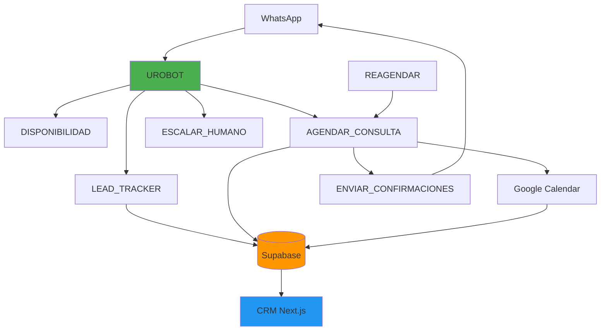

# 🔄 Integración n8n → Supabase → CRM UROBOT

## 📋 Tabla de Contenidos
1. [Visión General](#visión-general)
2. [Arquitectura de Flujos](#arquitectura-de-flujos)
3. [Flujos n8n Detallados](#flujos-n8n-detallados)
4. [Integración con Supabase](#integración-con-supabase)
5. [Consumo desde el CRM](#consumo-desde-el-crm)
6. [API Routes Requeridas](#api-routes-requeridas)
7. [Webhooks y Callbacks](#webhooks-y-callbacks)
8. [Estado Actual y Recomendaciones](#estado-actual-y-recomendaciones)

---

## 🎯 Visión General

### Stack de Integración
```
WhatsApp (Wasender) 
    ↓
n8n Workflows (7 flujos)
    ↓
Supabase PostgreSQL (funciones RPC)
    ↓
CRM Next.js (API Routes + Hooks)
    ↓
Dashboard React (Real-time UI)
```

### Flujos Disponibles
| Flujo | Propósito | Estado | Integración Supabase |
|-------|-----------|--------|---------------------|
| **UROBOT** | Chatbot principal con IA | ✅ Activo | ❌ Parcial |
| **LEAD_TRACKER_UROBOT** | Tracking de leads | ✅ Activo | ✅ Completa |
| **AGENDAR_CONSULTA** | Agendamiento de citas | ✅ Activo | ✅ Completa |
| **DISPONIBILIDAD_CALENDARIO** | Consulta horarios | ✅ Activo | ❌ No usa DB |
| **ENVIAR_CONFIRMACIONES** | Recordatorios automáticos | ⚠️ Standalone | ⚠️ Lee DB, no escribe |
| **REAGENDAR_CONSULTA** | Cambio de citas | ✅ Activo | ✅ Completa |
| **ESCALAR_A_HUMANO** | Atención humana | ✅ Activo | ❌ No integrado |

---

## 🏗️ Arquitectura de Flujos

### Diagrama de Interacción



### Flujo de Datos

1. **Entrada**: Usuario envía mensaje a WhatsApp
2. **Procesamiento**: n8n recibe webhook de Wasender
3. **IA**: UROBOT procesa con Google Gemini
4. **Herramientas**: Llama a sub-workflows según intención
5. **Persistencia**: Guarda en Supabase vía RPC functions
6. **Respuesta**: Envía mensaje formateado a WhatsApp
7. **Dashboard**: CRM consulta datos en tiempo real

---

## 📊 Flujos n8n Detallados

### 1. UROBOT (Flujo Principal)

**Propósito**: Chatbot inteligente con IA para atención automática 24/7

**Componentes**:
- **Webhook**: Recibe mensajes de WhatsApp (Wasender)
- **Google Gemini**: LLM principal (modelo: gemini-2.5-flash-lite)
- **Transcripción**: OpenAI Whisper para notas de voz
- **Herramientas**:
  - `GET_DISPONIBILIDAD_CALENDARIOS`: Consulta horarios
  - `ESCALAR_HUMANO`: Deriva a atención humana
- **Vector Store**: Supabase para RAG (conocimiento_procedimientos_urologia)

**Integraciones Supabase**:
```typescript
// ❌ PROBLEMA: UROBOT NO registra conversaciones en DB
// Solo usa Vector Store para RAG

// ✅ DEBERÍA HACER:
await supabase.rpc('registrar_mensaje_conversacion', {
  p_lead_id: leadUuid,
  p_mensaje_id: whatsappMessageId,
  p_es_bot: false,
  p_contenido: mensaje,
  p_tipo_mensaje: 'texto'
})
```

**Webhook Endpoint**:
```
POST /webhook/e257a96a-f46a-4a68-b7b7-79f3dadfbe2b
```

**System Prompt** (resumen):
- Nombre: UroBot - Asistente del Dr. Mario Martínez Thomas
- Funciones: Consultar disponibilidad, agendar, reagendar, escalar
- Políticas de seguridad: Detecta urgencias médicas
- Sedes: Polanco (Temístocles 210) y Satélite (Circuito Centro Comercial 2251)

---

### 2. LEAD_TRACKER_UROBOT

**Propósito**: Registrar y actualizar leads en Supabase

**Flujo**:
1. Recibe datos del lead (nombre, teléfono, fuente)
2. Llama a función RPC `upsert_lead_interaction`
3. Retorna status (CREATED/UPDATED)

**Función Supabase**:
```sql
SELECT * FROM upsert_lead_interaction(
  p_nombre_completo := 'Juan Pérez',
  p_telefono_whatsapp := '+526241234567',
  p_fuente_lead := 'WhatsApp',
  p_estado := 'Nuevo',
  p_notas_iniciales := 'Primer contacto',
  p_session_id := 'session_123'
);
```

**Respuesta**:
```json
{
  "success": true,
  "action": "CREATED",
  "lead_id": "JUAN-a1b2c3d4",
  "lead_uuid": "uuid...",
  "telefono": "6241234567",
  "total_interacciones": 1
}
```

**Integración CRM**:
```typescript
// API Route: /api/leads/track
export async function POST(request: Request) {
  const payload = await request.json()
  
  // Llamar directamente a Supabase (mismo RPC que n8n)
  const { data } = await supabase.rpc('upsert_lead_interaction', {
    p_nombre_completo: payload.nombre,
    p_telefono_whatsapp: payload.telefono,
    p_fuente_lead: 'CRM_Web'
  })
  
  return Response.json(data)
}
```

---

### 3. AGENDAR_CONSULTA

**Propósito**: Agendar consultas médicas con validación completa

**Flujo Completo**:
1. **Parse & Prepare**: Valida y normaliza datos de entrada
2. **FreeBusy**: Consulta disponibilidad en Google Calendar
3. **Process FreeBusy**: Detecta conflictos y duplicados
4. **Double Check**: Protección contra race conditions
5. **Verify Slot**: Doble verificación (ventana de 24h)
6. **Merge Context**: Genera idempotency hash
7. **Create Event**: Crea evento en Google Calendar
8. **Prepare CRM Data**: Prepara payload para Supabase
9. **Execute RPC**: Llama `upsert_appointment_atomic_from_calendar`
10. **Call ENVIAR_CONFIRMACIONES**: Inicia recordatorios

**Función Supabase Principal**:
```sql
SELECT * FROM upsert_appointment_atomic_from_calendar(
  p_paciente_id := 'PAC-123',
  p_nombre_completo := 'Juan Pérez',
  p_telefono := '6241234567',
  p_consulta_id := 'CONS-2025-001',
  p_sede := 'POLANCO',
  p_tipo_cita := 'primera_vez',
  p_motivo_consulta := 'Evaluación urológica',
  p_duracion_minutos := 30,
  p_fecha_hora_utc := '2025-11-15T22:00:00Z',
  p_fecha_consulta := '2025-11-15',
  p_hora_consulta := '16:00:00',
  p_calendar_event_id := 'evt_google_123',
  p_calendar_link := 'https://calendar.google.com/...',
  p_operation_id := 'op-2025-001',
  p_idempotency_key := 'idem-key-123'
);
```

**Respuesta**:
```json
{
  "success": true,
  "operation_id": "op-2025-001",
  "paciente_uuid": "uuid...",
  "consulta_uuid": "uuid...",
  "is_new_paciente": true,
  "is_new_consulta": true,
  "lead_updated": true
}
```

**Calendarios**:
- **POLANCO**: `92dbbeda09a6dfba909c43d9f05553f65309adcb629f35759153e59e3e401fc0@group.calendar.google.com`
- **SATELITE**: `ecdb381f314048b2662edd2d3169899eaab6e17bbc181151998ce7ad1ac0dabf@group.calendar.google.com`

---

### 4. DISPONIBILIDAD_CALENDARIO

**Propósito**: Consultar horarios disponibles del doctor

**Flujo**:
1. **CARGAR_HORARIOS**: Carga configuración de horarios
2. **SET_DEFAULTS**: Normaliza parámetros de entrada
3. **SCHEDULE_GATE**: Valida horarios del doctor
4. **Availability (POLANCO/SATELITE)**: Consulta Google Calendar
5. **Normalize Busy**: Normaliza eventos ocupados
6. **Combine Busy**: Combina horarios de ambas sedes
7. **Calc Availability**: Calcula slots disponibles
8. **Build Response**: Formatea respuesta para LLM

**Entrada**:
```json
{
  "desiredStart": "2025-11-15T00:00:00Z",
  "userText": "¿Hay disponibilidad para el viernes?",
  "sedePreferida": "POLANCO",
  "timezone": "America/Mexico_City",
  "windowDays": 14,
  "maxResults": 50
}
```

**Salida**:
```json
{
  "kind": "avail",
  "llmContext": {
    "summary": "Encontré 15 horarios disponibles",
    "primary": {
      "date": "2025-11-15",
      "dayName": "Viernes",
      "options": [
        {"time24": "16:00", "time12": "4:00 PM", "sede": "Polanco"}
      ]
    },
    "backups": [...]
  },
  "slots": [...]
}
```

**⚠️ IMPORTANTE**: Este flujo NO interactúa con Supabase. Solo consulta Google Calendar.

---

### 5. ENVIAR_CONFIRMACIONES

**Propósito**: Sistema de recordatorios automáticos

**Modos de Operación**:
1. **IMMEDIATE**: Envío individual tras agendar
2. **BATCH**: Procesamiento masivo (cron 8AM y 2PM)
3. **REPLY**: Respuesta a confirmación del paciente

**Flujo IMMEDIATE**:
1. Recibe datos de consulta
2. Valida ventanas de tiempo (48h, 24h, 3h)
3. Construye mensaje personalizado
4. Envía vía WhatsApp (Wasender)
5. Valida entrega
6. **❌ NO ACTUALIZA** estado en Supabase

**Flujo BATCH**:
1. **❌ NO CONSULTA** `recordatorios` table
2. Lee directamente de `consultas`
3. Filtra por ventanas de tiempo
4. Procesa recordatorios pendientes

**Integración Actual**:
```typescript
// ❌ PROBLEMA: No usa tabla recordatorios
// ❌ PROBLEMA: No usa claim_due_recordatorios()
// ❌ PROBLEMA: No marca como enviado

// ✅ DEBERÍA HACER:
const { data: recs } = await supabase.rpc('claim_due_recordatorios', {
  p_limit: 50
})

for (const rec of recs) {
  await enviarWhatsApp(...)
  
  await supabase.rpc('mark_recordatorio_enviado', {
    p_recordatorio_id: rec.id,
    p_mensaje: mensaje,
    p_entregado: true
  })
}
```

---

### 6. REAGENDAR_CONSULTA

**Propósito**: Cambiar fecha/hora de citas existentes

**Flujo**:
1. **Validate Input**: Valida nueva fecha/hora/sede
2. **Buscar Consulta**: Busca en Supabase por teléfono o consulta_id
3. **Process Search Result**: Valida estado de cita
4. **Parse New DateTime**: Normaliza nueva fecha
5. **Validate Doctor Schedule**: Verifica horario del doctor
6. **Call DISPONIBILIDAD**: Verifica disponibilidad
7. **Check if Available**: Valida slot libre
8. **Cancel Old Event**: Cancela en Google Calendar
9. **Call AGENDAR_CONSULTA**: Agenda nueva cita
10. **Update CRM**: Actualiza estado

**Función PostgreSQL Custom**:
```sql
-- Esta función NO existe aún en Supabase
-- ❌ DEBE CREARSE

CREATE OR REPLACE FUNCTION buscar_consulta_para_reagendar(
  p_telefono TEXT,
  p_consulta_id TEXT
) RETURNS TABLE(...) AS $$
BEGIN
  -- Lógica de búsqueda
END;
$$ LANGUAGE plpgsql;
```

---

### 7. ESCALAR_A_HUMANO

**Propósito**: Derivar casos complejos a atención humana

**Motivos de Escalamiento**:
- `hablar_con_persona`: Solicitud explícita
- `facturacion`: Solicitud de CFDI
- `programar_cirugia`: Agendar cirugía
- `dudas_costos`: Preguntas sobre precios
- `quiere_llamada`: Solicita ser contactado
- `informacion_adicional`: Info que el bot no tiene

**Flujo**:
1. Recibe contexto del paciente
2. Formatea mensajes para asistente (Mónica) y paciente
3. Envía WhatsApp a asistente
4. **❌ NO CREA** registro en tabla `escalamientos`

**Integración Requerida**:
```typescript
// ✅ DEBE HACER:
await supabase.from('escalamientos').insert({
  telefono_mx10: telefono,
  lead_id: leadUuid,
  motivo: motivo,
  prioridad: prioridad,
  resumen_contexto: contexto,
  conversation_snapshot: JSON.stringify(historial),
  canal: 'WhatsApp'
})
```

---

## 🔗 Integración con Supabase

### Funciones RPC Utilizadas

| Función | Flujo que la usa | Estado |
|---------|------------------|--------|
| `upsert_lead_interaction` | LEAD_TRACKER | ✅ Implementada |
| `upsert_appointment_atomic_from_calendar` | AGENDAR_CONSULTA | ✅ Implementada |
| `registrar_mensaje_conversacion` | **Ninguno** | ⚠️ No usada |
| `claim_due_recordatorios` | **Ninguno** | ⚠️ No usada |
| `mark_recordatorio_enviado` | **Ninguno** | ⚠️ No usada |
| `buscar_consulta_para_reagendar` | REAGENDAR | ❌ No existe |

### Tablas Accedidas

| Tabla | Lectura | Escritura | Flujo |
|-------|---------|-----------|-------|
| `leads` | ✅ | ✅ | LEAD_TRACKER |
| `pacientes` | ✅ | ✅ | AGENDAR_CONSULTA |
| `consultas` | ✅ | ✅ | AGENDAR/REAGENDAR |
| `recordatorios` | ❌ | ❌ | **Ninguno** |
| `conversaciones` | ❌ | ❌ | **Ninguno** |
| `escalamientos` | ❌ | ❌ | **Ninguno** |
| `conocimiento_procedimientos_urologia` | ✅ | ❌ | UROBOT (RAG) |

---

## 🖥️ Consumo desde el CRM

### Patrón Recomendado: API Routes como Proxy

```typescript
// app/api/n8n/webhook/route.ts
export async function POST(request: Request) {
  const payload = await request.json()
  
  // Validar payload
  const schema = z.object({
    tipo: z.enum(['lead', 'consulta', 'escalamiento']),
    datos: z.object({...})
  })
  
  const validado = schema.parse(payload)
  
  // Procesar según tipo
  switch (validado.tipo) {
    case 'lead':
      return handleLead(validado.datos)
    case 'consulta':
      return handleConsulta(validado.datos)
    case 'escalamiento':
      return handleEscalamiento(validado.datos)
  }
}
```

### Hooks de React para Datos en Tiempo Real

```typescript
// hooks/useLeadsRealtime.ts
export function useLeadsRealtime() {
  const [leads, setLeads] = useState<Lead[]>([])
  
  useEffect(() => {
    // Cargar iniciales
    const fetchLeads = async () => {
      const { data } = await supabase
        .from('leads')
        .select('*')
        .order('fecha_primer_contacto', { ascending: false })
      
      setLeads(data || [])
    }
    
    fetchLeads()
    
    // Suscribirse a cambios
    const channel = supabase
      .channel('leads-changes')
      .on('postgres_changes', {
        event: '*',
        schema: 'public',
        table: 'leads'
      }, (payload) => {
        if (payload.eventType === 'INSERT') {
          setLeads(prev => [payload.new as Lead, ...prev])
        } else if (payload.eventType === 'UPDATE') {
          setLeads(prev => prev.map(l => 
            l.id === payload.new.id ? payload.new as Lead : l
          ))
        }
      })
      .subscribe()
    
    return () => {
      supabase.removeChannel(channel)
    }
  }, [])
  
  return { leads }
}
```

---

## 🔌 API Routes Requeridas

### 1. Webhook para n8n
```typescript
// app/api/webhooks/n8n/route.ts
export async function POST(request: Request) {
  const { action, data } = await request.json()
  
  switch (action) {
    case 'lead_created':
      // Notificar UI vía Server-Sent Events
      await notifyDashboard('lead', data)
      break
      
    case 'consulta_agendada':
      // Enviar notificación
      await sendNotification(data.paciente_telefono, 'Cita confirmada')
      break
      
    case 'escalamiento':
      // Alerta al equipo
      await alertTeam(data)
      break
  }
  
  return Response.json({ success: true })
}
```

### 2. Proxy para Disponibilidad
```typescript
// app/api/disponibilidad/route.ts
export async function POST(request: Request) {
  const { fecha, sede } = await request.json()
  
  // Llamar al workflow de n8n
  const response = await fetch('https://n8n.yourdomain.com/webhook/...', {
    method: 'POST',
    headers: { 'Content-Type': 'application/json' },
    body: JSON.stringify({
      desiredStart: fecha,
      sedePreferida: sede,
      source: 'crm_web'
    })
  })
  
  const disponibilidad = await response.json()
  return Response.json(disponibilidad)
}
```

### 3. Dashboard de Recordatorios
```typescript
// app/api/recordatorios/pending/route.ts
export async function GET() {
  const { data } = await supabase
    .from('recordatorios')
    .select(`
      *,
      consultas(
        *,
        pacientes(nombre_completo, telefono)
      )
    `)
    .eq('estado', 'pendiente')
    .lte('programado_para', new Date().toISOString())
  
  return Response.json(data)
}
```

---

## 📡 Webhooks y Callbacks

### Configurar Webhooks en n8n

Cada flujo que necesite notificar al CRM debe tener un nodo HTTP Request al final:

```javascript
// Nodo "Notify CRM" en AGENDAR_CONSULTA
{
  "method": "POST",
  "url": "https://your-crm.vercel.app/api/webhooks/n8n",
  "body": {
    "action": "consulta_agendada",
    "data": {
      "consulta_id": "{{ $json.consulta_id }}",
      "paciente_nombre": "{{ $json.patient.nombre }}",
      "fecha": "{{ $json.appointment.fecha_iso }}"
    }
  }
}
```

### Recibir en el CRM

```typescript
// Webhook receiver con validación
export async function POST(request: Request) {
  // Validar firma (seguridad)
  const signature = request.headers.get('x-n8n-signature')
  if (!validateSignature(signature, await request.text())) {
    return new Response('Unauthorized', { status: 401 })
  }
  
  const payload = await request.json()
  
  // Procesar y emitir evento
  await processWebhook(payload)
  
  // Emitir a clientes conectados (Server-Sent Events o WebSockets)
  await broadcastToClients(payload)
  
  return Response.json({ received: true })
}
```

---

## ⚠️ Estado Actual y Recomendaciones

### Problemas Críticos Identificados

1. **❌ UROBOT no registra conversaciones**
   - Solución: Agregar nodo que llame `registrar_mensaje_conversacion`
   - Impacto: No hay historial de chat en el CRM

2. **❌ ENVIAR_CONFIRMACIONES no usa tabla recordatorios**
   - Solución: Reescribir para usar `claim_due_recordatorios` y `mark_recordatorio_enviado`
   - Impacto: Recordatorios no se sincronizan con DB

3. **❌ ESCALAR_HUMANO no crea registros**
   - Solución: Insertar en tabla `escalamientos`
   - Impacto: No hay tracking de escalamientos

4. **❌ REAGENDAR necesita función personalizada**
   - Solución: Crear `buscar_consulta_para_reagendar` en Supabase
   - Impacto: Reagendamiento puede fallar

5. **❌ No hay webhooks bidireccionales**
   - Solución: Implementar API Routes y notificaciones
   - Impacto: CRM no recibe actualizaciones en tiempo real

### Prioridades de Implementación

#### Sprint 1 (Alta Prioridad)
- [ ] Crear función `buscar_consulta_para_reagendar`
- [ ] Agregar registro de conversaciones en UROBOT
- [ ] Implementar webhooks n8n → CRM

#### Sprint 2 (Media Prioridad)
- [ ] Reescribir ENVIAR_CONFIRMACIONES para usar tabla recordatorios
- [ ] Agregar escritura en `escalamientos`
- [ ] Crear API Routes de proxy

#### Sprint 3 (Baja Prioridad)
- [ ] Implementar real-time dashboard
- [ ] Agregar métricas y monitoring
- [ ] Optimizar performance de queries

---

## 📚 Próximos Pasos

Consulta la documentación complementaria:
- **[08_N8N_WORKFLOWS_DETAILED.md](./08_N8N_WORKFLOWS_DETAILED.md)** - Detalles técnicos de cada flujo
- **[09_CRM_INTEGRATION_GUIDE.md](./09_CRM_INTEGRATION_GUIDE.md)** - Guía de implementación en el CRM
- **[10_MISSING_FUNCTIONS.md](./10_MISSING_FUNCTIONS.md)** - Funciones SQL faltantes
